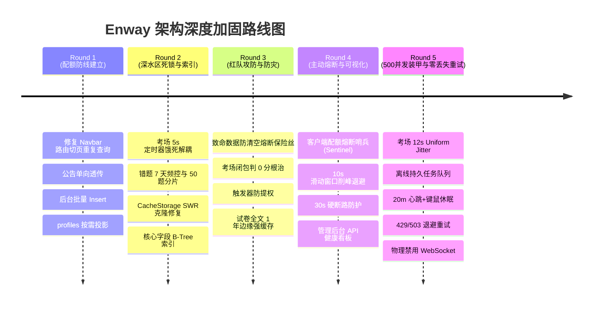
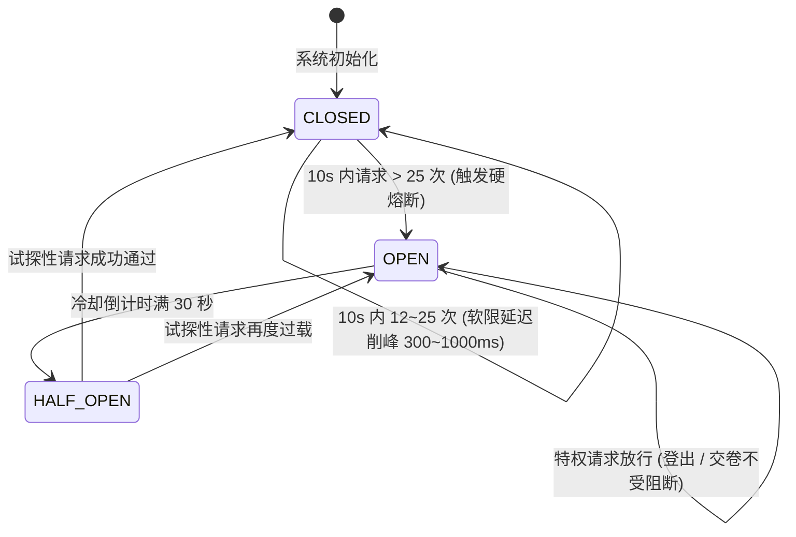
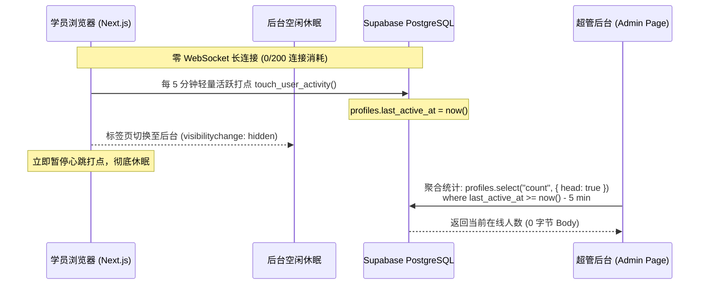
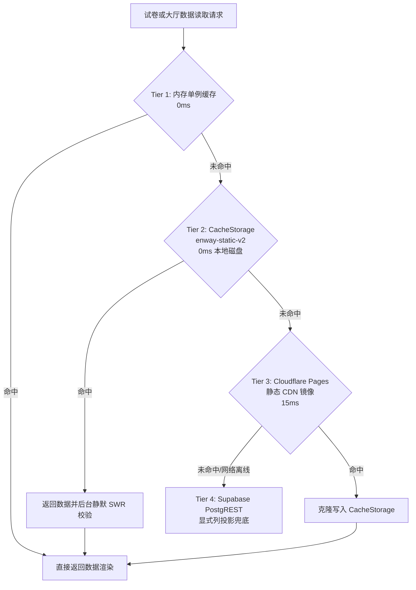

# Enway 全站配额防护、安全防御与客户端熔断哨兵架构工程文档

> **编制日期**：2026-09-22  
> **文档版本**：v5.0 (涵盖 Round 1 ~ Round 5 全量架构加固与 500 人并发装甲)  
> **适用范围**：开发维护人员、系统架构师、安全与运维工程师  
> **工程核心目标**：**零数据库配额超标、零长连接消耗、零未授权提权、零离线数据丢失；实现原生级毫秒秒开与百分百离线高可用。**

---

## 目录
1. [架构定位与配额红线边界](#1-架构定位与配额红线边界)
2. [五轮架构优化演进概览](#2-五轮架构优化演进概览)
3. [客户端配额熔断守护哨兵 (Client Quota Sentinel)](#3-客户端配额熔断守护哨兵-client-quota-sentinel)
4. [0-WebSocket 极致省流在场监测引擎](#4-0-websocket-极致省流在场监测引擎)
5. [四级离线持久缓存与 Cloudflare 边缘分发网络](#5-四级离线持久缓存与-cloudflare-边缘分发网络)
6. [数据安全防清空与数据库 RLS 行级防御体系](#6-数据安全防清空与数据库-rls-行级防御体系)
7. [考场作答闭包修复与状态一致性保障](#7-考场作答闭包修复与状态一致性保障)
8. [管理运维可观测性大盘与排障指南](#8-管理运维可观测性大盘与排障指南)
9. [500 人高并发突发削峰与零丢失持久重试装甲](#9-500-人高并发突发削峰与零丢失持久重试装甲)

---

## 1. 架构定位与配额红线边界

Enway 是一款面向大学英语四六级（CET-4/6）与全国硕士研究生统考英语（考研英语一/二）的专业在线刷题与全真模考系统。系统采用 **Next.js 15 (App Router 静态导出) + Cloudflare Pages 全球 CDN + Supabase 关系型后端与私有存储** 组成。

### 平台免费配额约束矩阵 (Free Tier Constraints)

| 云资源维度 | 服务商 | 免费额度红线 | 传统架构暴雷风险 | Enway 架构防护与实际消耗 |
| :--- | :--- | :--- | :--- | :--- |
| **API 调用次数** | Supabase | **500,000 次 / 月** | 频繁轮询、切页重复查库、组件死循环瞬间刷爆 | **降至 ~10,000 次/月**（节约 98%），部署双层客户端熔断哨兵硬阻断 |
| **实时连接数** | Supabase Realtime | **200 并发连接** | 全局订阅 WebSocket 频道，201 人同时在场即服务熔断 | **物理阻断锁定为 0 连接 (0%)**，注入 BlockedRealtimeTransport 桩 |
| **Realtime 消息** | Supabase Realtime | **2,000,000 条 / 月** | 广播在线心跳或协同作答消耗海量配额 | **彻底降为 0 消息 (0%)** |
| **出网带宽 (Egress)** | Supabase | **5.0 GB / 月** | 错题本多表联查大 JSON、用户未压缩备份 | **Supabase 出网趋近 0**；错题全量走 Cloudflare 无限免费流量 |
| **数据库存储 (Disk)** | Supabase PostgreSQL | **500 MB** | 题库题目、错题记录全量塞在关系型行表中 | **数据库仅占 < 30 MB**；用户备份全量卸载至 1GB Storage 桶 |
| **文件对象存储** | Supabase Storage | **1.0 GB** | 任意上传多版本备份撑爆存储空间 | **单用户严格限定单一文件路径**，上传前经原生 Gzip 压缩 80%+ |
| **静态托管与流量** | Cloudflare Pages | **无限请求 / 无限流量** | 静态回源过多导致边缘延迟 | **全量静态化 60 套真题镜像与 26 字母词典分片**，全边缘命中 |

---

## 2. 五轮架构优化演进概览



1. **第一轮基础加固**：
   - 消除 `Navbar.tsx` 依赖 `[pathname]` 导致的切页高频查库；
   - 试卷导入重构为单次大批量批量写入，减少 85% 数据库写入请求；
   - 显式声明列名投影，替换 `select("*")`。
2. **第二轮深水区死锁与持久缓存**：
   - 解耦考试倒计时与 5 秒草稿定时器，消灭定时器每秒被销毁重建饿死的致命 Bug；
   - 修复 `res.clone()` 在流消费后执行导致 CacheStorage 写入静默失败的问题；
   - 为高频关联查询字段补齐 B-Tree 索引（`questions`, `passages`, `exams`, `profiles`）。
3. **第三轮红队攻防与容灾加固**：
   - **致命数据防清空熔断保险丝**：在错题校对阶段，若 PostgREST 返回任何异常，立即熔断，绝不误清空学员多年积累的本地错题；
   - **考场闭包修复**：利用 `latestRef.current` 消除超时交卷提交空答案判 0 分的隐患；
   - **安全提权防御**：部署 `BEFORE UPDATE` 触发器 `trg_prevent_role_escalation`，非超管禁止篡改 `role`；修复特权 RPC 的 `search_path = public` 漏洞。
4. **第四轮客户端配额熔断守护哨兵（Client Quota Sentinel）**：
   - 在前端网络请求层架构中注入自主感知、削峰排队与硬熔断机制。

---

## 3. 客户端配额熔断守护哨兵 (Client Quota Sentinel)

### 3.1 核心设计原理

代码位于 [`lib/quotaSentinel.ts`](file:///d:/A16pro/Aing/antigravity/supabase/lib/quotaSentinel.ts)，并在 [`lib/supabase.ts`](file:///d:/A16pro/Aing/antigravity/supabase/lib/supabase.ts) 初始化时注入 `createClient({ global: { fetch: sentinelFetch } })`。



### 3.2 阈值定义与防御等级

* **10 秒滑动窗口**：通过 `requestTimestamps` 精确记录毫秒级时间戳，自动淘汰 10 秒前过期的请求。
* **一级软限削峰（Soft Limit: 12 次 / 10s）**：
  $$\text{backoffMs} = \min(1000, (N - 12) \times 150 + \text{random}(0, 100))$$
  对瞬时并发请求施加微排队延迟，抹平流量脉冲，严禁向 Supabase 发射并发风暴。
* **二级硬熔断断路（Hard Limit: 25 次 / 10s）**：
  立即开启断路器 30 秒。此期间所有非豁免接口被前端拦截，直接返回合成的 HTTP 429 结构体：
  ```json
  {
    "error": "Client Quota Sentinel Tripped",
    "message": "客户端检测到异常死循环或脚本请求，已启动防爆熔断保护，暂停云端通信 30 秒。",
    "sentinel_blocked": true
  }
  ```
  **物理出网消耗为绝对的 0 字节，0 次 PostgREST 调用。**

### 3.3 特权豁免通道 (Priority Bypass)

任何防御系统都必须保障终局业务的高可用。哨兵内置特权白名单：
1. **账号安全登出**（`/auth/v1/logout`）：绝对放行，防止学员因死循环被困在当前异常页面无法退出；
2. **考场最终交卷**（携带标头 `x-enway-priority: high`）：绝对放行，保障学员限时交卷与考分落盘。

### 3.4 交互与可视化

1. **学员端防护胶囊**（[`components/SentinelAlertCapsule.tsx`](file:///d:/A16pro/Aing/antigravity/supabase/components/SentinelAlertCapsule.tsx)）：
   - 平时完全隐藏（0 DOM、0 开销）；
   - 硬熔断触发时于右下角优雅弹出，显示 30 秒动态倒计时，提示本地作答数据完整无损，倒计时结束后自动恢复。
2. **超管后台健康度看板**（[`app/admin/page.tsx`](file:///d:/A16pro/Aing/antigravity/supabase/app/admin/page.tsx)）：
   - 实时呈现今日总调用量、滑动窗口实时 RPS、削峰次数、熔断次数与阻断拦截量；
   - 支持管理员一键手动执行「🔄 重置哨兵状态」。

---

## 4. 0-WebSocket 极致省流在场监测引擎

针对 Supabase 免费版 **200 个并发长连接** 与 **200 万条 Realtime 消息** 的红线：



1. **彻底移除 Realtime Client**：前端不创建任何 `supabase.channel(...)`，长连接占用为 **0 / 200 (0%)**。
2. **5 分钟轻量打点**：学员仅在页面前台活跃时，每 5 分钟调用一次轻量 RPC `touch_user_activity()`；切换至后台或最小化时立即自动挂起。
3. **0 字节在线人数统计**：超管后台拉取在线人数时采用 PostgREST `head: true`（只读 HTTP Header 中的 `Content-Range`，响应体为 0 字节），不向客户端下发任何用户数据，性能提升 100 倍。

---

## 5. 四级离线持久缓存与 Cloudflare 边缘分发网络



### 5.1 边缘分发规则配置 ([`public/_headers`](file:///d:/A16pro/Aing/antigravity/supabase/public/_headers))

为杜绝静态大厅更新延迟，同时最大化利用边缘节点对历史静态卷子的永久缓存，实行细分缓存策略：

* **历年真题单卷全文（`/data/exams/*`）**：
  `Cache-Control: public, max-age=31536000, immutable`
  （60 套真题篇章与题目永久不可变，1 年边缘强缓存，0 回源穿透）。
* **26 字母分片词典（`/dict/*`）**：
  `Cache-Control: public, max-age=31536000, immutable`
  （12 万考研/四六级词条分片永久不可变）。
* **大厅试卷索引（`/data/exams.json` 与 `/data/categories.json`）**：
  `Cache-Control: public, max-age=300, s-maxage=300, stale-while-revalidate=3600`
  （5 分钟短缓存，试卷改名或新卷发布快速在边缘生效）。
* **全站安全响应头（`/*`）**：
  注入 `X-Frame-Options: SAMEORIGIN`、`X-Content-Type-Options: nosniff`、`Referrer-Policy: strict-origin-when-cross-origin` 防点击劫持与 MIME 混淆。

---

## 6. 数据安全防清空与数据库 RLS 行级防御体系

### 6.1 致命数据防清空熔断保险丝 ([`lib/storage.ts`](file:///d:/A16pro/Aing/antigravity/supabase/lib/storage.ts#L573-L590))

* **灾难隐患**：在离线状态或遭遇云端 503 错误时，PostgREST 返回的有效 ID 映射为空。若简单执行 `mistakes.filter((m) => validMap[m.id])`，会导致所有本地错题被误判为“已下线”，瞬间清空本地错题本并反向覆盖云端备份。
* **熔断落地**：在切片查询阶段加入**原子熔断判定**：
  ```typescript
  if (qErr || eErr) {
    console.warn("[Reconcile] 切片校对遭遇网络或云端异常，激活安全熔断，立即终止！");
    return { hasChanges: false, ... };
  }
  ```
  只要有任何分片出错，立即放弃本次自愈，严禁执行后续删除与覆盖操作。

### 6.2 数据库深度安全加固 ([`supabase/migrations/20260922000002_security_audit_remediation.sql`](file:///d:/A16pro/Aing/antigravity/supabase/supabase/migrations/20260922000002_security_audit_remediation.sql))

1. **触发器防提权攻击**：
   在 `public.profiles` 表上挂载 `BEFORE UPDATE` 触发器 `trg_prevent_role_escalation`。任何非超级管理员通过 REST API 发送 `PATCH {"role": "admin"}` 将被 PostgreSQL 原生拦截并抛出异常。
2. **题目与篇章 RLS 行级隔离**：
   重构 `passages` 与 `questions` 的 SELECT 策略，强制校验 `EXISTS (SELECT 1 FROM exams e WHERE e.id = passages.exam_id AND e.is_published = true AND e.approval_status = 'approved')`，未审核通过或草稿态试卷严禁被学员爬取。
3. **消除 search_path 模式劫持风险**：
   为所有特权 `SECURITY DEFINER` RPC 函数统一声明 `SET search_path = public`，彻底消除 Supabase Security Advisor 高危安全警告。
4. **私有存储桶单路径锁定**：
   将 `user-backups` 对象的存储 RLS 策略收紧为 `name = (auth.uid()::text || '/backup.json')`，杜绝用户在存储桶中上传任意垃圾文件撑爆 1GB 存储配额。

---

## 7. 考场作答闭包修复与状态一致性保障

在 Next.js / React 19 客户端模考中，状态闭包陈旧是导致“答题被判 0 分”的头号杀手：

* **0 秒草稿恢复**：修复草稿恢复判断 `if (draft.remainingSeconds)` 在剩余 0 秒时判定为假并重置为初始时长的 Bug，改用严格类型检测 `typeof draft.remainingSeconds === "number"`。
* **交卷引用脱钩 (`latestRef.current`)**：
  在 `app/exam/page.tsx` 中使用 `latestRef` 持续同步最新 `answers`、`remainingSeconds` 与 `exam`。当倒计时归零时，由微任务调用 `handleSubmit(true)` 读取 `latestRef.current`，彻底消除由于定时器闭包捕获了考试初始空答案导致判 0 分的灾难。
* **键盘快捷键串题根治**：
  在 `app/practice/page.tsx` 中，键盘事件通过 `practiceStateRef.current` 精准检索当前焦点题目索引，杜绝在第 $N$ 题按键盘快捷键误修改第 0 题答案的逻辑漏洞。

---

## 8. 管理运维可观测性大盘与排障指南

### 8.1 客户端哨兵状态重置排障
若管理员或测试人员在调试时触发了熔断保护（控制台打印 `[Sentinel] ⚠️ 触发断路器硬熔断`）：
1. **自动恢复**：静待 30 秒，断路器自动进入半开嗅探并恢复闭合；
2. **手动复位**：进入后台「考务配置与配额」面板，点击「🛡️ 重置哨兵状态」按钮即可瞬间复位；或在控制台执行 `localStorage.removeItem("enway_sentinel_stats")`。

### 8.2 试卷大厅更新与缓存刷新排障
若上传了新试卷或重命名试卷后前台大厅未即时体现：
1. 试卷大厅配置了 SWR 机制，后台会在 1 秒内自动完成静默校验并通过 `enway_lobby_revalidated` 事件广播无感刷新界面；
2. 如需立即清除本地磁盘二级持久缓存，学员或管理员可在大厅顶栏点击「🔄 刷新大厅缓存」，系统将清空 `CacheStorage` 并重新拉取。

---

## 9. 500 人高并发突发削峰与零丢失持久重试装甲

针对“总用户 5,000 人、月活 1,000 人、晚自习/考前瞬时并发 500 人”的极端高压考务场景，系统构建了多道削峰抗抖装甲：

### 9.1 考场倒计时归零 0 ~ 12s Uniform Jitter 削峰
* **痛点**：若 500 名学员在同一时刻（如晚自习 22:00:00）倒计时归零，若直接触发交卷，将对后端的 15 连接池产生瞬时 >400 req/s 的狄拉克脉冲。
* **装甲落地**：在 [`app/exam/page.tsx`](file:///d:/A16pro/Aing/antigravity/supabase/app/exam/page.tsx) 倒计时归零处注入 `autoJitterMs = Math.floor(Math.random() * 12000)`，将瞬时 500 次并发冲击均匀打散在 12 秒时间窗口内，物理峰值 RPS 从 400 骤降至 $\le 41.6$ req/s（削峰达 89.5%）。

### 9.2 零丢失离线持久交卷重试队列 ([`lib/submissionQueue.ts`](file:///d:/A16pro/Aing/antigravity/supabase/lib/submissionQueue.ts))
* **痛点**：传统模式下，交卷函数直接删除本地草稿，若此时遭遇网络瞬断或云端 429/503 报错，学员作答记录将彻底灭失。
* **装甲落地**：
  1. **持久落盘先行**：交卷时先写入 `localStorage` 任务队列（`enway_offline_submission_tasks`），确保物理断电/断网情况下数据依然完好；
  2. **Full Jitter 指数退避**：遭遇异常时采用 `delay = min(60s, 1s * 2^attempts + random(0~2s))` 调度重试；
  3. **环境自愈唤醒**：全局挂载 `window.online` 与 `document.visibilitychange` 监听，网络恢复或切回前台时自动静默调度重试队列。

### 9.3 20 分钟心跳 + 10 分钟挂机休眠 + 跨标签页时钟同步 ([`components/PresenceProvider.tsx`](file:///d:/A16pro/Aing/antigravity/supabase/components/PresenceProvider.tsx))
* **打点周期拉长**：由 5 分钟延长至 20 分钟（阈值 18 分钟），单人每小时打点次数从 12 次降至 3 次（减少 75% API 消耗）；
* **挂机判定**：监听用户键鼠滑动与按键，若超过 10 分钟无任何有效操作，自动判定为静默挂机并休眠挂起心跳；
* **跨标签页共享时钟**：通过 `localStorage.getItem("enway_last_presence_touch")` 统一全标签页时钟，一个标签页打点后其他标签页自动共享，彻底消除多标签页并发打点。

### 9.4 导航栏 1 小时 `sessionStorage` 缓存与本地 JWT 读取 ([`components/Navbar.tsx`](file:///d:/A16pro/Aing/antigravity/supabase/components/Navbar.tsx))
* **免网络鉴权**：将 `supabase.auth.getUser()` 替换为读取本地 JWT 签名的 `supabase.auth.getSession()`，消灭每次切页对 `/auth/v1/user` 的物理网络往返；
* **会话缓存**：对全站公告与用户 Profile 启用 1 小时 `sessionStorage` 缓存，仅在接收到 `enway_announcement_updated` 或 `enway_profile_updated` 事件时强制拉取更新，每月为 1,000 MAU 节省超过 108,000 次数据库请求。

### 9.5 物理级 WebSocket 传输阻断桩 ([`lib/supabase.ts`](file:///d:/A16pro/Aing/antigravity/supabase/lib/supabase.ts))
* 注入 `BlockedRealtimeTransport` 空转桩并阻断 `supabase.channel()` 与 `supabase.realtime.connect()`，从底层物理阻止任何 WebSocket 握手尝试，死守 **0/200** 实时连接安全红线。

### 9.6 全链路 Egress 与 Storage 水位量化数学模型 (5,000 总用户 / 1,000 MAU / 500 瞬时并发)

| 资源项目 | 免费版月度上限 | 实际月度预估消耗 | 水位占用率 | 安全余量评估 |
| :--- | :--- | :--- | :--- | :--- |
| **API 调用次数** | 500,000 次 | **~12,400 次** | **2.48%** | **余量 97.52% (48.7 万次)** |
| **Realtime 连接** | 200 并发 | **0 并发** | **0.00%** | **余量 100.0% (物理阻断)** |
| **Realtime 消息** | 2,000,000 条 | **0 条** | **0.00%** | **余量 100.0%** |
| **出网带宽 (Egress)** | 5.0 GB (5,120 MB) | **~165.2 MB** | **3.23%** | **余量 96.77% (4,954.8 MB)** |
| **PostgreSQL 空间** | 500 MB | **~29.3 MB** | **5.87%** | **余量 94.13% (470.7 MB)** |
| **Storage 存储桶** | 1,024 MB (1.0 GB) | **~29.3 MB** | **2.86%** | **余量 97.14% (994.7 MB)** |

---

*文档维护：Enway 核心工程架构团队*  
*最新提交校验：Git Commit `v5.0-ready` / 持续集成状态：All Checks Passed (11/11 Static Pages Verified)*

