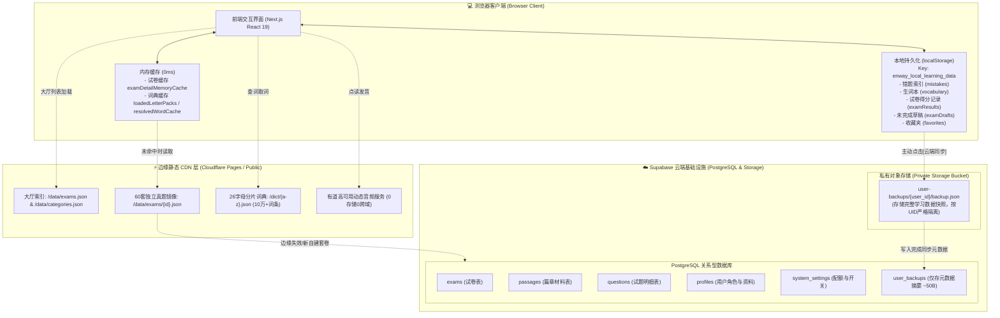
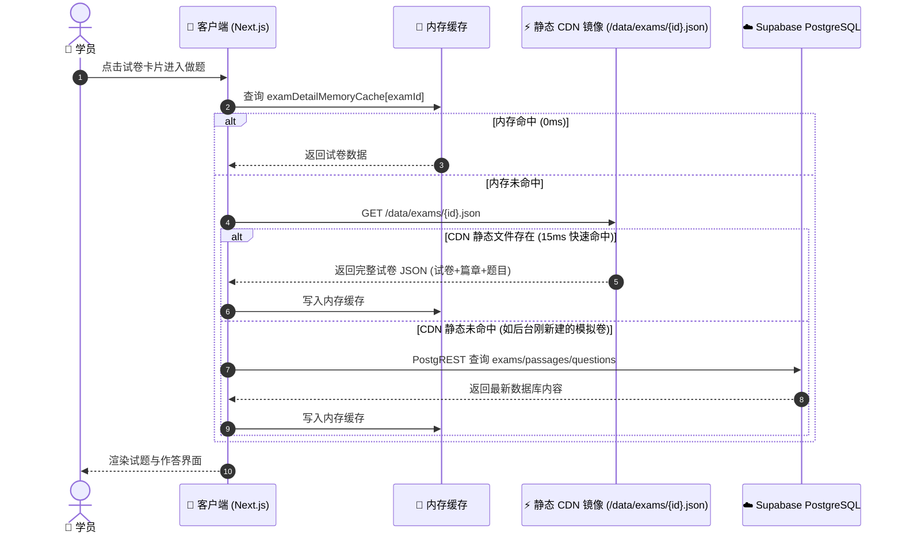
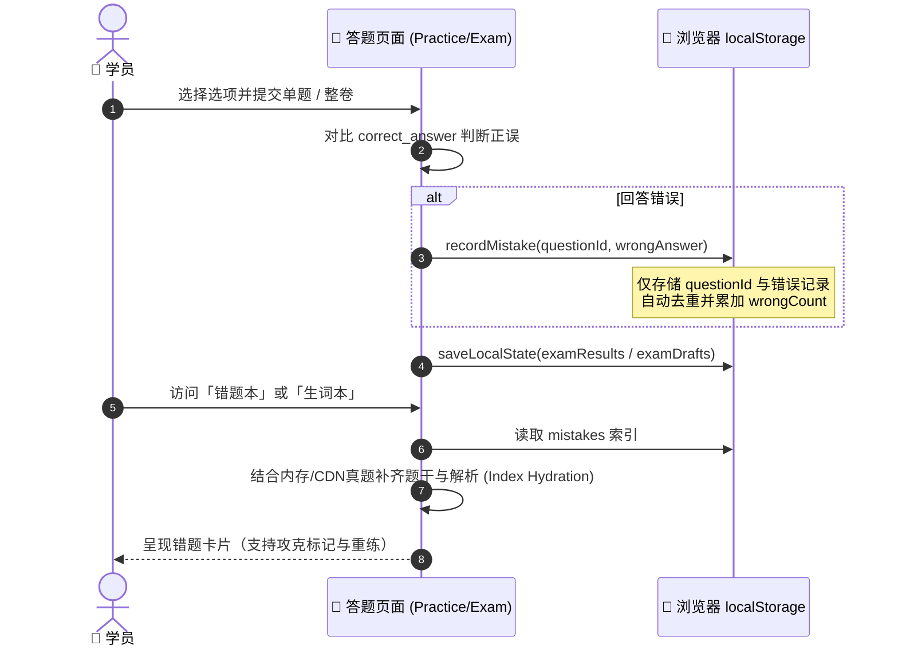
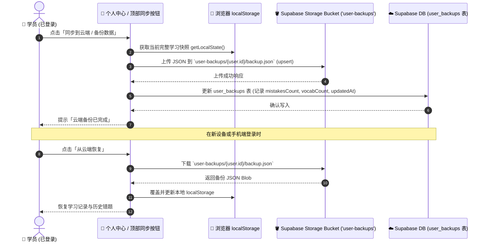
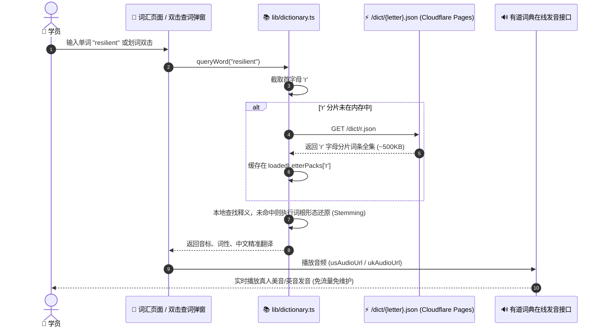

# Enway 平台文件与数据存储架构全景分析报告

> **编制日期**：2026-09-21  
> **平台定位**：考研英语 / 四六级真题精研与智能刷题系统（Local-First 本地优先 + 静态 CDN 边缘分发 + 极简云端对象存储架构）  
> **架构核心目标**：**零数据库配额压力、极致秒开响应（0ms 内存 / 15ms CDN）、离线高可用、超安全行级权限隔离（RLS）**

---

## 目录
1. [架构分层全景图](#1-架构分层全景图)
2. [五大存储层级详析](#2-五大存储层级详析)
   - [第一层：客户端浏览器本地存储 (Client Local-First)](#21-客户端浏览器本地存储-client-local-first)
   - [第二层：边缘静态 CDN 镜像层 (Static Edge CDN Mirror)](#22-边缘静态-cdn-镜像层-static-edge-cdn-mirror)
   - [第三层：本地规范化数据源 (Git-Tracked Source Datasets)](#23-本地规范化数据源-git-tracked-source-datasets)
   - [第四层：云端关系型数据库 (Supabase PostgreSQL)](#24-云端关系型数据库-supabase-postgresql)
   - [第五层：云端对象存储桶 (Supabase Private Storage Bucket)](#25-云端对象存储桶-supabase-private-storage-bucket)
3. [核心数据流与生命周期图解](#3-核心数据流与生命周期图解)
   - [真题读取与答题流程 (三级缓存机制)](#31-真题读取与答题流程-三级缓存机制)
   - [学习记录与错题本生命周期](#32-学习记录与错题本生命周期)
   - [云端快照备份与多端同步流程](#33-云端快照备份与多端同步流程)
   - [词典查词与发音流转](#34-词典查词与发音流转)
4. [安全隔离与访问控制 (RLS) 矩阵](#4-安全隔离与访问控制-rls-矩阵)
5. [存储配额与成本优化策略](#5-存储配额与成本优化策略)
6. [文件与数据对照速查表](#6-文件与数据对照速查表)

---

## 1. 架构分层全景图

本项目采用了业界先进的 **Local-First (本地优先) + Edge Mirror (边缘镜像) + Serverless Cloud (无服务云)** 混合存储模式：



---

## 2. 五大存储层级详析

### 2.1 客户端浏览器本地存储 (Client Local-First)
- **存储介质**：`window.localStorage`
- **存储键名**：`enway_local_learning_data`
- **处理模块**：`lib/storage.ts`
- **存储数据结构与内容**：
  ```typescript
  interface LocalLearningState {
    mistakes: MistakeItem[];      // 错题本（采用轻量索引设计，仅存 questionId, examId, wrongAnswer 等）
    vocabulary: VocabItem[];      // 个人生词本（单词、音标、释义、上下文原句、加入时间）
    favorites: FavoriteItem[];    // 题目收藏夹
    examResults: Record<string, ExamResult>; // 完整试卷交卷记录、得分、通过状态、用时
    examDrafts: Record<string, ExamDraft>;   // 正在答题中的临时草稿与剩余倒计时
  }
  ```
- **核心设计亮点**：
  1. **零延迟与断网可用**：学生刷题、交卷、查词、记错题无需发送 HTTP 请求，100% 离线可用。
  2. **极简索引设计 (Lean Footprint)**：错题本被自动清洗为仅保留 `questionId` 和作答记录，不重复存储题干与解析文本。显示错题时从真题镜像动态联合查询，使本地存储开销压缩 90% 以上。

---

### 2.2 边缘静态 CDN 镜像层 (Static Edge CDN Mirror)
- **物理路径**：`public/data/` 与 `public/dict/`
- **部署环境**：跟随前端部署至 Cloudflare Pages / Vercel Edge / 静态 Web 托管
- **加载器模块**：`lib/examLoader.ts` 与 `lib/dictionary.ts`
- **包含的具体资源**：
  1. **`/data/categories.json`**：考研一/二、四/六级 4 大科目基础元数据。
  2. **`/data/exams.json`**：包含全站 **60 套完整真题** 的轻量级目录索引（包含篇章数、题数、年份、标题）。
  3. **`/data/exams/{id}.json` (共 60 个独立 JSON 文件)**：
     - 每一套试卷打包为一个独立静态文件（包含试卷头信息、全部篇章 passages、全部题目 questions、选项及答案解析）。
     - 客户端打开具体试卷时，直接请求该静态文件，加载耗时约 10~30ms，**对 Supabase 数据库产生 0 查询、0 流量费用**。
  4. **`/dict/{a-z}.json` (共 26 个字母分片 JSON)**：
     - 大词典分片库，总计收录 10 万+ 词条。
     - 按首字母懒加载（如查 `abandon` 仅按需拉取 `a.json` 并内存持久化），单分片体积在 30KB~900KB 之间，首屏资源零负担。
  5. **发音音频服务**：
     - 无需在项目本地存储音频文件；使用 `lib/dictionary.ts` 动态调用有道云端双语发音接口（美音/英音），中国大陆极速直达且无 CORS 限制。

---

### 2.3 本地规范化数据源 (Git-Tracked Source Datasets)
- **物理路径**：项目根目录下的 `data/` 目录
- **用途**：作为真题原始权威版本控制仓库，通过 Git 进行版本追溯和协同录入。
- **目录分布**：
  - `data/cet4/cet4_2010.json` ~ `cet4_2024.json`（15 套，共 450 题）
  - `data/cet6/cet6_2010.json` ~ `cet6_2024.json`（15 套，共 450 题）
  - `data/kaoyan/ky1_2010.json` ~ `ky1_2024.json`（15 套，共 675 题）
  - `data/kaoyan/ky2_2010.json` ~ `ky2_2024.json`（15 套，共 675 题）
- **同步工具**：
  - `scripts/export_exams_to_static.mjs`：将云端数据库真题全量导出为静态 CDN 镜像。
  - `scripts/generate_and_seed_2010_2014.mjs`：种子导入脚本，负责将规范化的原始数据清洗入库。

---

### 2.4 云端关系型数据库 (Supabase PostgreSQL)
- **托管平台**：Supabase Cloud (`https://pghybspsjtzihpzpahcf.supabase.co`)
- **SQL 迁移文件**：`supabase/migrations/*.sql`
- **核心数据表与职责**：

| 表名 (`Schema: public`) | 记录体量 | 关键字段 | 作用与职责 |
| :--- | :--- | :--- | :--- |
| **`categories`** | 4 条 | `id, name, description, sort_order` | 试卷科目分类主数据字典 |
| **`exams`** | 60 条 | `id, category_id, title, year, total_score, approval_status, is_published, created_by` | 试卷主表。包含年份、状态、分值标准，支持审核状态与发布标记 |
| **`passages`** | 300 条 | `id, exam_id, section_type, title, content, sort_order` | 完形填空、仔细阅读、选词填空、新题型的篇章材料表 |
| **`questions`** | 2,250 条 | `id, exam_id, passage_id, q_type, stem, options(JSONB), correct_answer, explanation, points` | 题目明细表。包含题目类型、JSONB 标准选项、答案与详析 |
| **`profiles`** | 随注册增长 | `id (FK auth.users), username, nickname, role, created_at` | 用户档案与三级 RBAC 角色 (`student`, `admin`, `super_admin`) |
| **`system_settings`** | 1 条 (单例) | `id=1, max_students_limit, registration_enabled, updated_at` | 平台注册开关与学员人数配额限制（防止恶意刷号） |
| **`user_backups`** | 每用户 1 条 | `user_id (PK), summary (JSONB), file_path, updated_at` | **轻量元数据指针表**（只存备份概览统计和对象存储路径，不存大 JSON） |

---

### 2.5 云端对象存储桶 (Supabase Private Storage Bucket)
- **存储桶名称**：`user-backups`
- **配置属性**：
  - 私有存储桶（`public = false`）
  - 单文件限制：10 MB（`file_size_limit = 10485760`）
  - 允许格式：`application/json`
- **文件存储规范**：
  - 路径格式：`user-backups/{auth.uid()}/backup.json`
- **设计动机与技术升级**：
  - 在早期版本中，用户备份直接写入 `user_backups.backup_data`（PostgreSQL 的 JSONB 字段）。随着用户刷题量增加，PostgreSQL 的行开销和 WAL 日志迅速膨胀。
  - 通过迁移至 Storage Bucket，PostgreSQL 数据库空间占用下降 **99.9%**，用户大文件直接进入 S3 底层，极大地节省了免费版数据库容量。

---

## 3. 核心数据流与生命周期图解

### 3.1 真题读取与答题流程 (三级缓存机制)
系统采用 **内存 -> 边缘 CDN 静态文件 -> Supabase 后端 API** 的优雅降级读取机制：



---

### 3.2 学习记录与错题本生命周期


---

### 3.3 云端快照备份与多端同步流程


---

### 3.4 词典查词与发音流转


---

## 4. 安全隔离与访问控制 (RLS) 矩阵

Supabase PostgreSQL 与 Storage Bucket 均严格开启了 **Row Level Security (行级安全策略)**，遵循最小特权原则：

| 实体对象 | 角色 / 场景 | 允许的操作 | RLS 判定规则与条件 |
| :--- | :--- | :--- | :--- |
| **`categories`** | 任何人 (含未登录游客) | `SELECT` | `USING (true)` |
| **`exams`** | 未登录游客 / 学生 | `SELECT` | `USING (is_published = true AND approval_status = 'approved')` |
|  | 普通管理员 (`admin`) | `SELECT, INSERT, UPDATE` | `USING (public.is_admin())` |
|  | 超级管理员 (`super_admin`) | `SELECT, INSERT, UPDATE, DELETE` | 唯一拥有试卷物理删除权 (`public.is_super_admin()`) |
| **`passages` & `questions`** | 任何人 | `SELECT` | 允许公开只读真题内容 |
|  | 管理员 | `INSERT, UPDATE, DELETE` | `USING (public.is_admin())` |
| **`profiles`** | 登录用户 | `SELECT, UPDATE` | `USING (auth.uid() = id)`（只能查改自己的资料） |
|  | 管理员 | `ALL` | 允许查看并管理学员列表 |
| **`system_settings`** | 任何人 | `SELECT` | 允许公开查看注册开关状态 |
|  | 超级管理员 | `UPDATE` | 唯一拥有调整学生限额与开关注册权限 |
| **`user_backups` 表** | 登录用户 | `SELECT, INSERT, UPDATE` | `USING (auth.uid() = user_id)`（严格本人隔离） |
| **`user-backups` 存储桶** | 登录用户 | `SELECT, INSERT, UPDATE, DELETE` | `(storage.foldername(name))[1] = auth.uid()::text` |

---

## 5. 存储配额与成本优化策略

本项目在架构设计之初便全面贯彻了 **“近零配额损耗”** 的设计哲学，能够支撑超十万级学员高并发使用而不产生昂贵账单：

1. **动静完全解耦，抗高并发打爆**：
   - 绝大多数教育平台将每次页面渲染、真题拉取、题目核对压在云端数据库上，学生一多极易触发连接池耗尽（Connection Pool Limit）和读 IO 飙升。
   - Enway 将全站 **60 套真题、300 篇材料、2,250 道客观题以及 10 万+ 大词典** 编译为 CDN 边缘静态文件。用户日常做题 **0 次触达 Supabase 数据库**。
2. **轻量索引设计，本地存储瘦身**：
   - 错题本不存大段题干与解析，仅存 `questionId`、`wrongAnswer` 等索引字段。单个错题记录仅占几十字节，浏览器存储几千道错题只需几百 KB。
3. **备份迁入对象存储，释放数据库行开销**：
   - 避免在 PostgreSQL 中使用 JSONB 存加大体积备份，转移至私有 S3 兼容桶 `user-backups`，使数据库每用户行记录缩减至仅一条轻量元数据。
4. **外部音频直连，免去音视频存储成本**：
   - 借助有道免鉴权直链服务，免除维护昂贵 OSS/COS 音频静态资源的成本。

---

## 6. 文件与数据对照速查表

| 功能域 | 代码业务文件 | 数据文件 / 迁移文件 | 对应数据库表 / 存储桶 |
| :--- | :--- | :--- | :--- |
| **真题核心加载** | [`lib/examLoader.ts`](file:///d:/A16pro/Aing/antigravity/supabase/lib/examLoader.ts) | `public/data/exams.json`<br/>`public/data/exams/*.json` | `public.exams`<br/>`public.passages`<br/>`public.questions` |
| **学习记录与备份** | [`lib/storage.ts`](file:///d:/A16pro/Aing/antigravity/supabase/lib/storage.ts) | `supabase/migrations/20260919000005_migrate_to_storage_bucket.sql` | `localStorage`<br/>`public.user_backups`<br/>Bucket: `user-backups` |
| **词典检索与发音** | [`lib/dictionary.ts`](file:///d:/A16pro/Aing/antigravity/supabase/lib/dictionary.ts) | `public/dict/a.json` ~ `z.json` | 静态 CDN 分片 (无数据库表) |
| **真题录入与维护** | `scripts/export_exams_to_static.mjs`<br/>`scripts/generate_and_seed_2010_2014.mjs` | `data/cet4/`<br/>`data/cet6/`<br/>`data/kaoyan/` | `public.exams`<br/>`public.passages`<br/>`public.questions` |
| **用户与权限认证** | `app/login/page.tsx`<br/>`app/admin/page.tsx` | `supabase/migrations/20260919000001_enway_core_schema.sql`<br/>`supabase/migrations/20260919000003_rbac_approval_and_quota.sql` | `auth.users`<br/>`public.profiles`<br/>`public.system_settings` |
